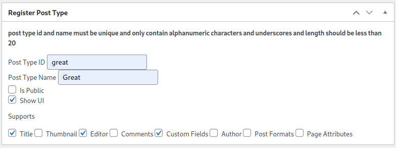

# Custom Post Type Manager

## Description

The Custom Post Type Manager plugin allows users to easily add and manage custom post types on their WordPress site. It provides a user-friendly interface for creating and configuring custom post types without the need for coding skills.

## Features

- **Dynamic Custom Post Types:** Create custom post types with ease.
- **User-Friendly Interface:** Intuitive and easy-to-use settings page.
- **Flexible Configuration:** Customize labels, supports, and other settings for each custom post type.
- **No Coding Required:** Ideal for users without coding knowledge who want to extend their site's content structure.

## Installation

1. Upload the `custom-post-type-manager` folder to the `/wp-content/plugins/` directory.
2. Activate the plugin through the 'Plugins' menu in WordPress.
3. Navigate to 'CPR' in the WordPress admin menu to create and manage custom post types.

## Usage

1. **Create a Custom Post Type:**
   - Go to the 'CPR' menu in the WordPress admin.
   - Click 'Register Custom Posts Here' to create new custom post type.
   - Click 'Add New' Button.
   - Fill in the required details and configure the settings.
   - Save the changes.

2. **Manage Custom Post Types:**
   - View a list of all created custom post types on the 'Custom Post Types'->'Register Custom Posts Here'.
   - Edit or delete existing custom post types as needed.

3. **Configure Settings:**
   - Customize labels, supports, and other settings for each custom post type.
   - Settings are available within the edit section of each custom post type.

## Screenshots

*Screenshot 1: Custom Post Type Manager settings page.*

*Screenshot 2: Adding a new custom post type.*

## Frequently Asked Questions

**Q: Can I use this plugin to create multiple custom post types?**
A: Yes, the plugin allows you to create and manage multiple custom post types.

**Q: Are there any coding skills required to use this plugin?**
A: No, the plugin is designed to be user-friendly, and no coding skills are necessary to create custom post types.

## Changelog

### 1.0.0
- Initial release

## Support

For support or feature requests, please [open an issue](https://github.com/your-username/custom-post-type-manager/issues).

## Contributing

If you'd like to contribute to the development of this plugin, please follow the [contribution guidelines](CONTRIBUTING.md).

## License

This plugin is licensed under the MIT License - see the [LICENSE](LICENSE) file for details.

